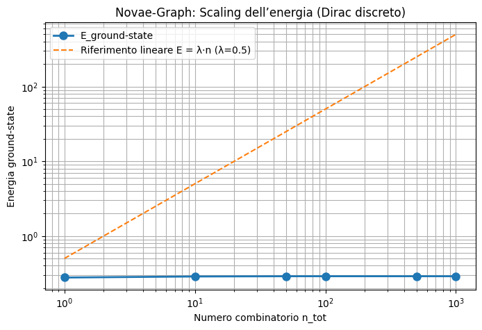
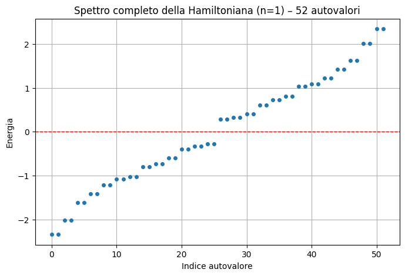

# Novae (ex Novabene)

**Framework geometrico-discreto per fisica, matematica e computing**

Sistema numerico a 21 stati bilanciati + dinamica Dirac discreta su grafo icosaedrico (kissing number 12).

- **Autore**: Filippo Mario Oppo – Perito Elettrotecnico  
- **Scopo**: Dimostrare competenze reali in **aritmetica non-standard**, **simulazione quantistica discreta** e **prototipazione hardware**  
- **Tecnologie**: Python, NumPy, SciPy – pronto per FPGA

## 📊 Risultati visivi (generati dal codice)

  
*Scaling dell’energia ground-state al variare di n_tot (log-log). Si nota la saturazione per grandi n (localizzazione).*

  
*Spettro completo dei 52 autovalori per n=1 (simmetria particella-antiparticella visibile).*

## 📌 Cosa contiene

### 1. Sistema numerico a 21 simboli (Novabene core)
- 21 stati: ∅, +0, −0, ±1…±9  
- Addizione **signed-digit** con riporto locale massimo ±1 (non fully carry-free, ma propagazione limitata e parallela)

### 2. Novae-Graph: Discrete Dirac Quantum Walk
- Grafo icosaedrico 13 nodi  
- Hamiltoniana Dirac 52×52 (hermitiana e unitaria)  
- Simulazione verificata di scaling energetico

## 🚀 Come eseguire

```bash
pip install numpy scipy matplotlib
python novabene_graph.py
